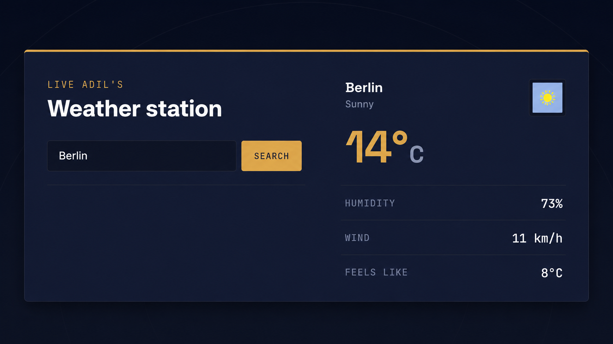

# React Weather App

A modern weather application built with React.js that provides real time weather information for any city using the OpenWeather API.

## Live Demo

🔗 https://adilweatherapp.netlify.app/

---
## Preview



---

## Features

- Search weather by city
- Real-time weather data
- Temperature display
- Humidity
- Wind speed
- Weather conditions
- Responsive UI
- Error handling for invalid cities
- Clean and modern interface

---

## Technologies Used

- React
- JavaScript (ES6+)
- CSS3
- OpenWeather API
- Vite

---

## Project Structure

```text
weather-app/
│
├── public/
├── src/
│   ├── assets/
│   ├── App.jsx
│   ├── main.jsx
│   └── index.css
│
├── package.json
├── vite.config.js
└── README.md
```

---
## Responsive Design

Optimized for

- Desktop
- Laptop
- Tablet
- Mobile

---

## Future Improvements

- 5-day weather forecast
- Current location weather
- Dark/Light mode
- Weather animations
- Air Quality Index

---

## Contact

Email:
adilishtiaq034@gmail.com

---

Developed & Designed by Adil Ishtiaq
